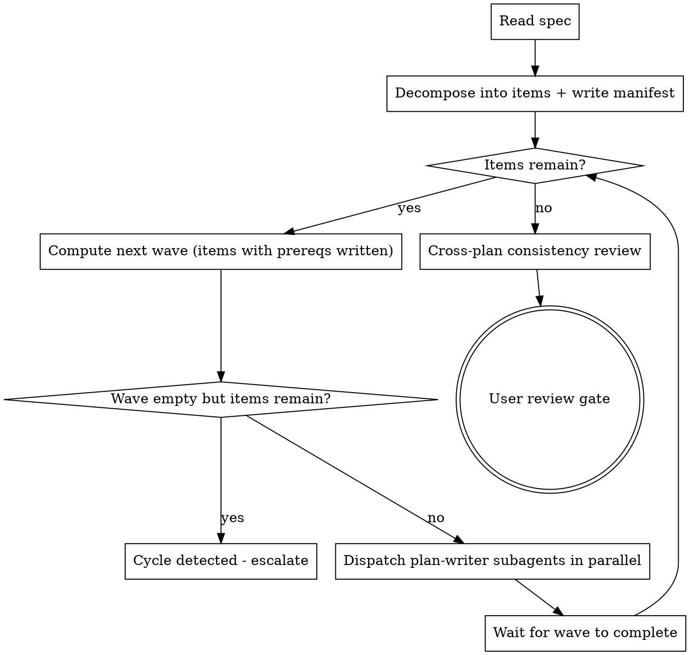
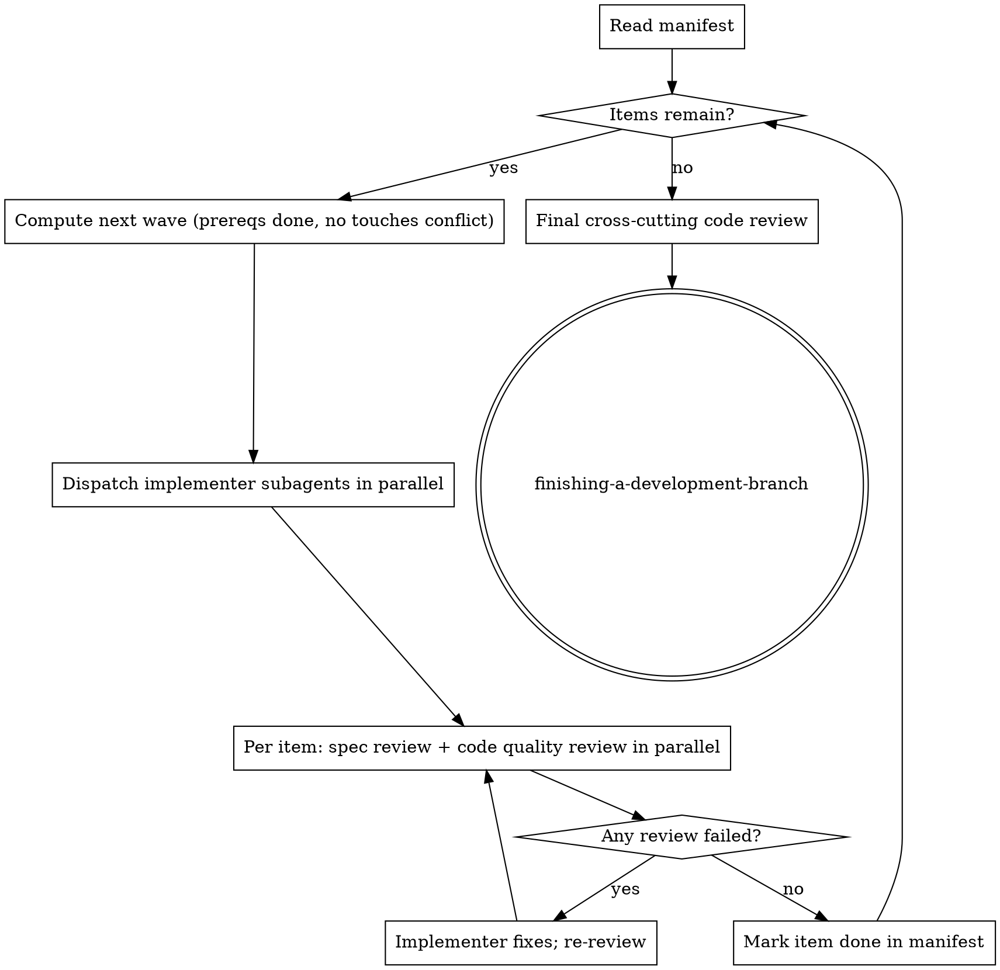

# Parallel Plan Writing & Execution — Design Spec

**Status:** Approved
**Date:** 2026-05-12
**Affects skills:** `writing-plans`, `executing-plans`, `subagent-driven-development`

## Problem

The current `writing-plans` skill produces a single monolithic plan file for an entire spec. One subagent (or the main agent) holds the whole spec in context while writing every task. This has three failure modes:

1. **Hallucination compounds.** A long plan accumulates type drift (function renamed mid-plan), copy-paste errors, and forgotten requirements as context fills.
2. **Review is all-or-nothing.** Reviewing a 30-task plan is harder than reviewing five focused 6-task plans. Defects hide.
3. **Sequential bottleneck.** Plan writing is single-threaded even when spec items are independent.

Execution has the same problem: `executing-plans` runs tasks sequentially; `subagent-driven-development` dispatches one implementer at a time. Independent items wait on unrelated work.

## Goal

Decompose plan writing and execution into per-item units that parallel subagents handle independently, coordinated by a controller in topological waves. Reduce hallucination, improve reviewability, and exploit independence where it exists.

## Non-Goals

- Replacing TDD, the existing task structure, or the self-review checklist. Per-item plans use the same task format (Files / Steps / code blocks / no placeholders).
- Cross-process locking or filesystem-based coordination between subagents. Coordination is the controller's job.
- Handling specs with one item — those use the existing single-file flow unchanged.

## Architecture

### File Layout

Plans become a directory, not a file:

```
docs/superpowers/plans/YYYY-MM-DD-<topic>/
  README.md            # Manifest: items, dependencies, file ownership, status
  01-<item-slug>.md    # Per-item plan, same task structure as today's plans
  02-<item-slug>.md
  ...
```

Single-item specs continue to produce a single `docs/superpowers/plans/YYYY-MM-DD-<topic>.md` file. The controller auto-detects: if it identifies only one item from the spec, it skips the directory layout.

### Manifest (`README.md`)

YAML frontmatter, human-readable body. The frontmatter is the source of truth for dependency graph and file ownership.

```markdown
---
spec: ../specs/2026-05-12-parallel-plan-writing-design.md
items:
  - id: "01"
    slug: hook-installer
    file: 01-hook-installer.md
    depends_on: []
    touches:
      - src/hooks/install.ts
      - tests/hooks/install.test.ts
    status: pending      # pending | writing | written | implementing | done
  - id: "02"
    slug: recovery-mode
    file: 02-recovery-mode.md
    depends_on: ["01"]
    touches:
      - src/hooks/recovery.ts
    status: pending
---

# <Feature> — Plan Index

Brief overview of the feature and how items compose. Links to each item plan.
```

**Fields:**
- `id`: zero-padded ordinal for stable filenames.
- `slug`: kebab-case, derived from the spec item title.
- `depends_on`: list of item IDs that must be both written (for the writing phase) or implemented (for the execution phase) before this item proceeds.
- `touches`: files this plan will create or modify. Used by the executor to prevent parallel dispatch on overlapping files.
- `status`: updated by the controller as the workflow advances. Not authoritative for resuming a half-finished run in v1 — see Open Questions.

### Per-Item Plan Files

Each `NN-<slug>.md` follows the **existing** plan task structure from the current `writing-plans` skill:

- Plan document header (Goal / Architecture / Tech Stack)
- File Structure section for files this plan touches
- Tasks with steps, code blocks, no placeholders
- Per-plan self-review at the end of writing

No new format is introduced. The decomposition happens at the directory level, not inside individual plan files.

## Writing Flow

The `writing-plans` skill becomes a controller that orchestrates plan-writer subagents.



### Decomposition (Step 1)

The controller reads the spec and identifies items. Heuristics, in order:

1. If the spec has numbered top-level sections that each describe an implementable unit, use those.
2. Otherwise, the controller proposes a decomposition and writes the manifest. Items must each produce working, testable software on their own.

Dependencies are inferred from the spec (one section references another's outputs) and from `touches` overlap (if two items modify the same file, one depends on the other unless they touch genuinely disjoint regions).

Single-item case: the controller skips this step and falls back to today's single-file flow.

### Wave Dispatch (Steps 2-4)

The controller computes the next wave as `{item | all item.depends_on are status:written}`. It dispatches one plan-writer subagent per item in the wave **in a single message with multiple Agent tool calls** so they run concurrently.

Each plan-writer subagent receives:

- The spec excerpt for its item (the controller extracts the relevant section — the subagent does not read the full spec).
- The full text of all prerequisite plan files (already written in earlier waves).
- The manifest's `touches` entry for its item.
- Project context: tech stack, established patterns, relevant existing files.
- A reference to the existing `writing-plans` task structure rules (Files / Steps / code blocks / no placeholders / TDD).

The subagent writes only its `NN-<slug>.md` file, runs the existing per-plan self-review, and returns.

After the wave completes the controller updates each item's `status` to `written` in the manifest.

### Cross-Plan Consistency Review (Step 5)

After all per-item plans are written, the controller (not a subagent — this is a coordination concern) runs a final review:

1. **Type and signature consistency:** function names, method signatures, and property names referenced across plans must match. A function defined in plan 01 and called in plan 03 must be spelled the same way and have matching parameters.
2. **Spec coverage:** every spec requirement maps to a task in some plan. Any gap is filled inline.
3. **Dependency correctness:** if plan 03 calls a function defined in plan 01, plan 03 must declare `depends_on: ["01"]`. Missing edges are added to the manifest.
4. **File ownership conflicts:** if two plans claim to create the same file, one must instead modify what the other created — adjust the plans inline.

Fixes are applied in place. Re-review is not required.

### User Review Gate (Step 6)

The controller presents the manifest path to the user and waits for approval before invoking execution.

## Execution Flow

`executing-plans` and `subagent-driven-development` both gain awareness of the plan directory layout. When pointed at a manifest, they orchestrate parallel execution; when pointed at a single plan file, they behave as today.



### Wave Computation with File-Ownership Guard

A wave is `{item | all prereqs are status:done AND no other in-wave item shares any path in touches}`. If two ready items overlap on files, the controller picks one for the current wave and defers the other. This prevents merge conflicts between concurrent subagents.

### Per-Item Implementer Dispatch

For each item in the wave, the controller dispatches an implementer subagent **in parallel** (one Agent call per item, all in one message). Each subagent receives the full text of its plan file plus a brief scene-setting context. It implements the plan task-by-task following the existing TDD + self-review loop and commits its own changes.

### Per-Item Review

After an implementer reports DONE, the controller dispatches **spec-compliance reviewer and code-quality reviewer in parallel** for that item (these are independent — running them serially as today is a leftover from sequential execution). The implementer fixes any issues; reviewers re-review until both approve. Then the item is marked `done`.

Implementer status handling (DONE, DONE_WITH_CONCERNS, NEEDS_CONTEXT, BLOCKED) is unchanged from today's `subagent-driven-development`.

### Final Cross-Cutting Review

After all items reach `done`, the controller dispatches a final code-reviewer subagent over the full set of commits — covering integration concerns the per-item reviewers couldn't see.

## Fallback Behavior

If any of the following is true, the controller uses the existing single-plan flow unchanged:

- The spec decomposes to one item.
- The runtime doesn't support parallel subagent dispatch (e.g., `executing-plans` invoked in a single-agent environment). In this case `executing-plans` reads the manifest and processes items sequentially in topological order, still benefiting from per-item plan files but without parallelism.

## Open Questions (resolved inline)

- **Resumability after partial failure:** v1 trusts manifest `status` fields as advisory only. If a run fails mid-execution, the user re-invokes; the controller infers state from git history (files modified, tests passing) rather than the manifest. Manifest-as-resume-state is a future enhancement.
- **Cycle detection:** if the controller computes a wave-empty-but-items-remain state, it escalates to the user with the dependency graph. There is no automatic cycle breaking.
- **Item count cap:** no hard cap. The controller may suggest re-decomposition if the spec produces more than ~10 items (signal that the spec should have been split during brainstorming).

## Skill Changes Summary

- **`writing-plans/SKILL.md`:** rewrite for the controller flow. Introduce manifest format. Keep existing task structure rules unchanged. Add new prompt templates: `plan-writer-prompt.md` (per-item plan writer).
- **`executing-plans/SKILL.md`:** add manifest-awareness. When given a directory, process in topological order. Single-agent environments stay sequential.
- **`subagent-driven-development/SKILL.md`:** add wave-based parallel dispatch, file-ownership guard, parallel per-item review (spec + quality concurrently). Add prompt template adjustments as needed.
- **No changes** to `test-driven-development`, `requesting-code-review`, `receiving-code-review`, `finishing-a-development-branch`.

## Success Criteria

- A spec with N independent items produces N plan files written by N parallel subagents in roughly the time of one.
- Cross-plan consistency review catches type drift before user review.
- Execution of N independent items completes in roughly the time of one, with no file-ownership conflicts between subagents.
- Single-item specs continue to work with no observable change in behavior.
