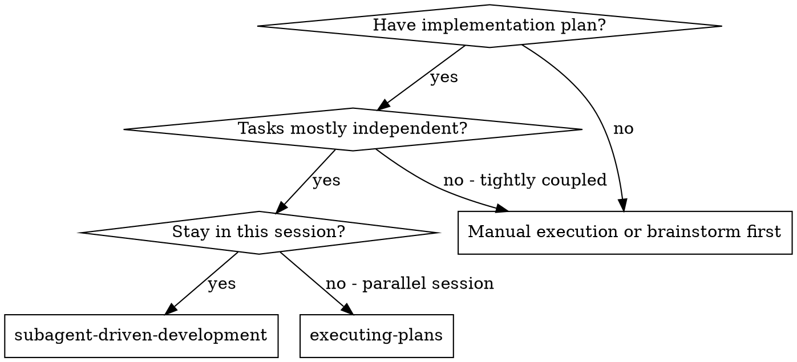
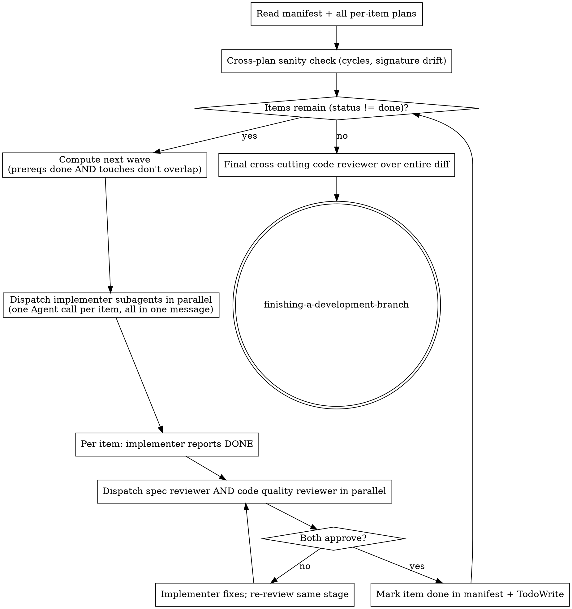
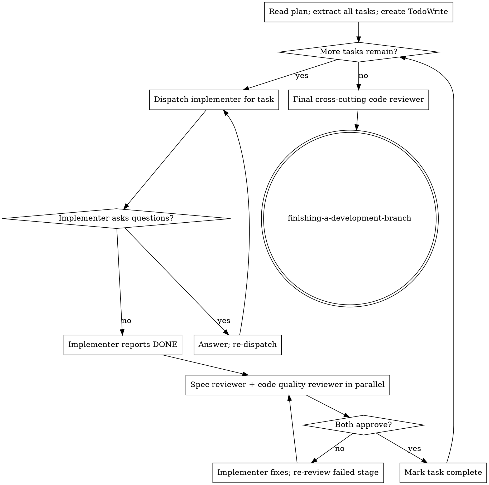

# Subagent-Driven Development

Execute a plan (single file or directory manifest) by dispatching fresh subagents per unit of work, with two-stage review (spec compliance + code quality) after each. For plan **directories**, items are processed in **parallel waves** based on the dependency graph.

**Why subagents:** You delegate to specialized agents with isolated context. You craft their instructions and context so they stay focused. They never inherit your session's history — you construct exactly what they need. This preserves your own context for coordination.

**Core principle:** Fresh subagent per task + two-stage review (spec then quality) + parallel waves where the dependency graph allows it.

## When to Use



## Detect the Plan Shape

- **Single plan file** → process tasks sequentially in this file. Use the per-task flow below.
- **Plan directory with manifest** (`README.md` with frontmatter listing items, `depends_on`, `touches`) → process items in **parallel waves** with file-ownership conflict prevention. See Wave Flow below.

## Wave Flow (plan directories)



### Wave Computation with File-Ownership Guard

A wave is the maximal set `{ item | all depends_on are status:"done" AND no other item in the same wave shares any path in touches }`.

- Build the set of ready items (all prereqs done).
- Greedily add items to the wave; an item is excluded if its `touches` overlaps any already-included item's `touches`.
- Deferred items get picked up in the next wave.
- If the wave is empty but items remain, you have a cycle or all remaining items conflict with an in-flight item — wait for the current wave to finish, then recompute.

This is what prevents parallel subagents from clobbering each other's files.

### Parallel Dispatch Rules

When dispatching a wave, **send a single message containing one Agent tool call per item.** That's how they run concurrently. Do not dispatch sequentially within a wave.

Each implementer subagent receives, via `./implementer-prompt.md`:
- The full text of its plan file (the per-item `NN-<slug>.md`).
- Scene-setting: where this item fits, what prerequisites have already shipped, paths to the prereq plans in case it needs to reference them.
- Working directory.

The implementer is responsible for its own commits.

### Per-Item Review (parallel)

After an implementer reports DONE, dispatch **both reviewers in a single message** — spec compliance and code quality run in parallel. They're independent; running them serially is a leftover from the old sequential flow.

- **Spec reviewer** (`./spec-reviewer-prompt.md`) compares the diff against the item's plan and the relevant spec excerpt. Approves or returns issues.
- **Code quality reviewer** (`./code-quality-reviewer-prompt.md`) reviews the diff for quality. Approves or returns issues.

If either reviewer finds issues, dispatch the implementer subagent to fix them, then re-dispatch the reviewer(s) that flagged issues. Loop until both approve. Then mark the item `done`.

### Final Cross-Cutting Review

After all items are `done`, dispatch one final code-reviewer subagent over the entire branch diff. This catches integration issues per-item reviewers couldn't see (cross-file coupling, broken end-to-end flows, accumulated tech debt).

## Single-File Flow (no manifest)

For a single plan file, use the original per-task loop:



Within a single plan file, tasks are dispatched **one at a time** — they share files and would conflict if parallelized.

## Model Selection

Use the least powerful model that can handle each role.

- **Mechanical implementation** (isolated functions, clear specs, 1-2 files) → fast cheap model.
- **Integration / judgment** (multi-file coordination, pattern matching, debugging) → standard model.
- **Architecture / design / review** → most capable model.

Signals:
- Touches 1-2 files with a complete spec → cheap.
- Multiple files with integration concerns → standard.
- Design judgment or broad codebase understanding required → most capable.

## Handling Implementer Status

Implementers report one of four statuses:

- **DONE** → proceed to review (spec + quality in parallel).
- **DONE_WITH_CONCERNS** → read the concerns. If they affect correctness or scope, address them before review. If they're observations, note and proceed.
- **NEEDS_CONTEXT** → provide what's missing and re-dispatch.
- **BLOCKED** → assess:
  1. Context problem → provide more context, re-dispatch same model.
  2. Reasoning required → re-dispatch with a more capable model.
  3. Task too large → break it into smaller pieces.
  4. Plan is wrong → escalate to human.

**Never** ignore an escalation or force the same model to retry without changes.

## Prompt Templates

- `./implementer-prompt.md` — implementer subagent.
- `./spec-reviewer-prompt.md` — spec compliance reviewer.
- `./code-quality-reviewer-prompt.md` — code quality reviewer.

## Example: Directory with Waves

```
Plan directory: docs/superpowers/plans/2026-05-12-foo/
Manifest: 4 items
  01 (depends_on: [])             touches: src/a.ts, tests/a.test.ts
  02 (depends_on: [])             touches: src/b.ts
  03 (depends_on: ["01"])         touches: src/c.ts
  04 (depends_on: ["01", "02"])   touches: src/c.ts   ← conflict with 03!

Wave 1: {01, 02}        — both ready, no touches overlap
  [Single message: Agent(implementer for 01), Agent(implementer for 02)]
  Both DONE.
  [Single message: Agent(spec reviewer 01), Agent(quality 01), Agent(spec 02), Agent(quality 02)]
  All approve. Mark 01, 02 done.

Wave 2: {03}            — 03 ready; 04 ready but conflicts with 03 on src/c.ts
  [Agent(implementer 03)]
  DONE. Reviewers approve. Mark 03 done.

Wave 3: {04}            — now 03 is done; 04 can run alone
  [Agent(implementer 04)]
  DONE. Reviewers approve. Mark 04 done.

Final cross-cutting reviewer over the whole diff. → finishing-a-development-branch.
```

## Advantages

**vs. manual execution:**
- Subagents follow TDD naturally.
- Fresh context per item/task.
- Parallel-safe within waves (file-ownership guard).
- Subagents can ask questions before and during work.

**vs. executing-plans:**
- Same session, no handoff.
- Continuous progress; no waiting between tasks.
- Review checkpoints automatic.
- Plan directories execute in parallel waves.

**Efficiency:**
- Controller curates context; subagents get exactly what they need.
- No file-reading overhead for subagents — controller pastes plan text.
- Reviewers run in parallel per item (was serial).

**Quality gates:**
- Self-review catches issues before handoff.
- Two-stage review per item (spec + quality, parallel).
- Review loops until approved.
- Final cross-cutting review over the whole diff.

**Cost:**
- More subagent invocations (implementer + 2 parallel reviewers per item + final).
- Controller does manifest parsing, wave computation, conflict checks.
- But catches issues early, far cheaper than debugging later.

## Red Flags

**Never:**
- Start implementation on main/master without explicit user consent.
- Dispatch multiple implementer subagents that touch overlapping `touches` paths — that's exactly what the file-ownership guard prevents.
- Skip reviews (spec OR quality).
- Run spec and quality reviewers serially when both can run in parallel.
- Proceed with unfixed issues.
- Make a subagent read the plan file when you can paste its text directly.
- Skip scene-setting context.
- Ignore subagent questions.
- Accept "close enough" on spec compliance.
- Move to the next wave while a current item has open review issues.
- Trust manifest `status` over git state when resuming.

**If a subagent asks questions:** answer clearly and completely. Don't rush them.

**If a reviewer finds issues:** implementer fixes, reviewer re-reviews. Don't skip the re-review.

**If a subagent fails a task:** dispatch a fix subagent with specific instructions. Don't fix manually (context pollution).

## Integration

**Workflow skills:**
- **Isolated workspace — OPTIONAL.** Default: create a fresh feature branch off main (`git checkout -b feature/<topic>`) and work in-place. Use `superpowers:using-git-worktrees` only when you specifically need an isolated working tree (e.g., to keep the current workspace untouched, or to run multiple plans in parallel). A branch is preferred unless the user asks for a worktree.
- **superpowers:writing-plans** — creates the plan (single file or directory) this skill executes.
- **superpowers:requesting-code-review** — code review template for reviewer subagents.
- **superpowers:finishing-a-development-branch** — completes development after all items.

**Subagents should use:**
- **superpowers:test-driven-development** — implementers follow TDD per task.

**Alternative workflow:**
- **superpowers:executing-plans** — sequential / parallel-session execution when subagents aren't available.
